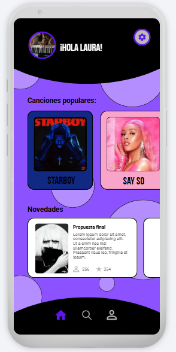

Laura Salas Ávila.
Poyecto iOS.
MasterD.
# MusicSpace
[TOC]
## 1. Conceptualización
### 1.1 ¿Cómo va a ser la aplicación? ¿De qué va la aplicación?
Para este ejercicio se ha realizado una aplicación simple que se conecta a una API de música usando JSON.
Para el próximo ejercicio de entrega de una aplicación iOS más completa se reutilizará esta aplicación, en ella podrás ver toda la música que hay disponible, las más populares, novedades, información de la canción...Es un espacio donde la gente puede comentar sobre sus canciones favoritas y ver que canciones y playlist han creado otras personas para echarlas un vistazo y luego escucharlas en tu plataforma favorita.

---

## 2. Diseño
### 2.1 ¿Diseño de la aplicación? ¿Dónde se diseñó?
Al ser un ejercicio más de conexión, el diseño es algo más simple y solo tendrá la pantalla de inicio con los datos de la API. Como todos los diseños de mis anteriores trabajos, todo se diseñó en Canva, se pondrá el diseño inicial en cada apartado junto con el diseño final de cómo se ve en la app.
<!-->#### 2.1.2 Buscar
#### 2.1.3 Favoritas
#### 2.1.4 Perfil usuario
#### 2.1.5 Detalle de la película
#### 2.1.6 Navegación
#### 2.1.3 Nombre + Icono de la app<!-->
#### 2.1.1 Inicio
Aquí esta la única pantalla de la app, en ella se ven los datos que se cogen de la API, también se ven algunos pequeños elementos de decoración y de colores.

#### 2.1.2 Icono de la app
El icono que se usará en la app es el siguiente:

## 3. Programación
### 3.1 Estructura del código
### 3.2 Elementos Implementados
### 3.3 API
La API que se ha usado ha sido la siguiente

## 4. Elementos destacables del desarrollo
### 4.1 Cosas del curso usadas más elementos destacables
### 4.2 Retos durante el desarrollo
1. Uso de Mac:
2. Algunos errores:
### 4.3 Elementos futuros
Ya que este proyecto será reultilazo para el proyecto final aquí pondré las cosas que se añadirán: 
## 5. Conclusión
Hacer este proyecto para ver de forma más profunda como funciona swift y xcode ha estado guay, resulta sencillo y rápido, lo único malo es que solo puedes realizar estos proyectos en un Mac algo que me ha costado ya que nunca usé uno y me tomo un tiempo adaptarme para ver los ejercicios.
