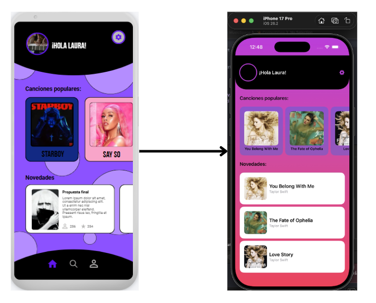

Laura Salas Ávila.
Poyecto iOS.
MasterD.
# MusicSpace
[TOC]
## 1. Conceptualización
### 1.1 ¿Cómo va a ser la aplicación? ¿De qué va la aplicación?
Para este ejercicio se ha realizado una aplicación simple que se conecta a una API de música usando JSON.
Para el próximo ejercicio de entrega de una aplicación iOS más completa se reutilizará esta aplicación, en ella podrás ver toda la música que hay disponible, las más populares, novedades, información de la canción...Es un espacio donde la gente podrá comentar sobre sus canciones favoritas y ver que canciones y playlist han creado otras personas para echarlas un vistazo y luego escucharlas en tu plataforma favorita si les han llamado la atención.

---

## 2. Diseño
### 2.1 ¿Diseño de la aplicación? ¿Dónde se diseñó?
Al ser un ejercicio más de conexión, el diseño es algo más simple por el momento y solo tendrá la pantalla de inicio con los datos de la API. Como todos los diseños de mis anteriores trabajos, todo se diseñó en Canva, se pondrá el diseño inicial en cada apartado junto con el diseño final de cómo se ve en la app en ejecución.
<!-->#### 2.1.2 Buscar
#### 2.1.3 Favoritas
#### 2.1.4 Perfil usuario
#### 2.1.5 Detalle de la película
#### 2.1.6 Navegación
#### 2.1.3 Nombre + Icono de la app<!-->
#### 2.1.1 Inicio
Aquí se ve la única pantalla de la app, en ella se muestran los datos que se cogen de la API, también se ven algunos pequeños elementos de decoración como colores, el header y las tarjetas.

#### 2.1.2 Icono de la app
El icono que se usará en la app es el siguiente: (por el momento no está añadido pero sí diseñado)

---

## 3. Programación
### 3.1 Estructura del código
El proyecto está desarrollado en Xcode utilizando SwiftUI.
Se sigue una "arquitectura" básica tipo MVVM:

- >View → interfaz de usuario
- >ViewModel → lógica y conexión con la API
- >Model → estructura de datos de las canciones

Cada parte está separada pero sin estar cada una en su propia carpeta específica debido a que el proyecto es pequeño todavía.

### 3.2 Elementos Implementados
- Uso de API externa
- Decodificación de JSON con Codable
- Uso de @Published para la actualización automática de la UI
- Listas y ForEach
- Carga de imágenes con AsyncImage
- Uso de ScrollView horizontal en las tarjetas y vertical en la pantalla
- Uso de Stacks: 
  - VStack
  - HStack
  - ZStack
  
### 3.3 API
La API que se ha usado para este ejercicio ha sido la siguiente:
- iTunes de Apple:
  - >https://itunes.apple.com/search?term=taylor&entity=song

Esta API devuelve la información en formato JSON con algunos de los siguientes datos que hemos usado:

- Nombre de la canción
- Artista
- Imagen del álbum de esa canción

---

## 4. Elementos destacables del desarrollo
### 4.1 Cosas del curso usadas más elementos destacables
- Uso de API y JSON
- Uso de diferentes stacks en SwiftUI
- Uso de vistas reutilizables (que en el futuro deberán estar fuera para no estar en el mismo archivo y tener tanto código)
- Manejo de imágenes desde la URL
- Diseño básico de la interfaz
- Separación de lógica con ViewModel
  
### 4.2 Retos durante el desarrollo
1. Uso de Mac: Al no tener Mac propio, tenía que pedir prestado uno usando AnyDesk, algo que realentizaba el proceso si el equipo no estaba disponible.
2. Aprender a usar Mac: Al no tener un Mac tuve que aprender a usarlo en poco tiempo para poder trabajar.
3. Algunos errores: Tuve un error que provocó varios errores, todo esto debido a que se me olvidó añadir un import importante.
   
### 4.3 Elementos futuros
Ya que este proyecto será reultilazo para el proyecto final, aquí pondré las cosas que se añadirán: 
- Más pantallas
- Mejor conexión con la API para que salgan más artistas
- Guardado de favoritos para hacer uso de bases de datos
- Mejorar la interfaz para el usuario
- Navegación entre pantallas
- Más información de las canciones
- Mejor organización de código
- Buscador
- Creación de listas para también el guardado en base de datos

--- 

## 5. Conclusión
Hacer este proyecto para ver de forma más profunda como funciona Swift y Xcode ha estado muy guay, resulta algo sencillo cuando ya has aprendido a usarlo pero aún me cuesta un poco, lo único malo es que solo puedes realizar estos proyectos en un Mac algo que me ha costado ya que nunca usé uno y me tomo un tiempo adaptarme para ver los ejercicios.
En el caso de cualquier error al descargar el proyecto puedes descargar el proyecto en mi Git: 
- >https://github.com/LauraSA29/MusicSpace
