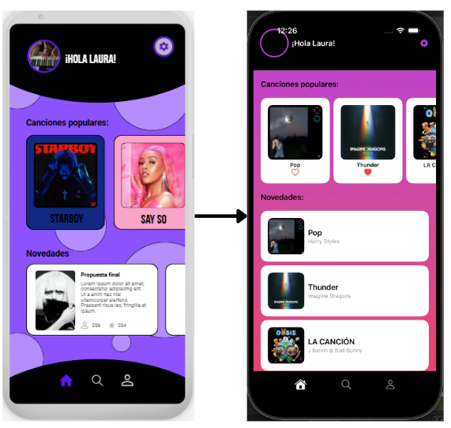
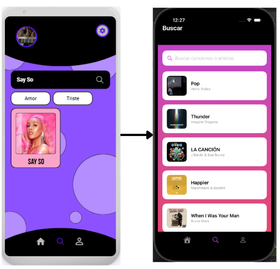
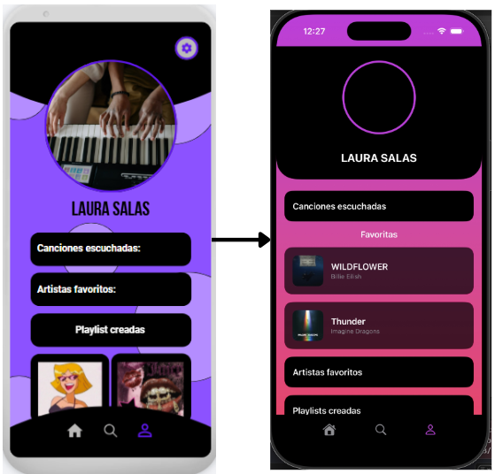
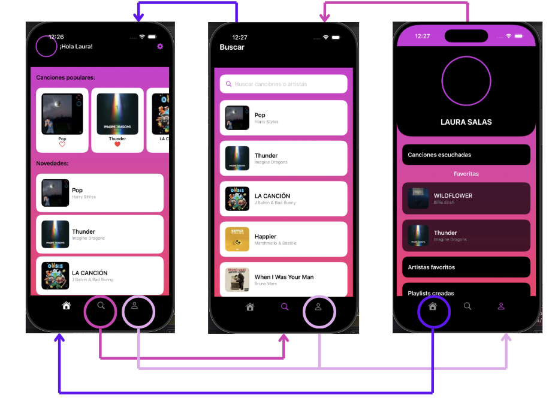

Laura Salas Ávila.
Poyecto iOS.
MasterD.
# MusicSpace
[TOC]
## 1. Conceptualización
### 1.1 ¿Cómo va a ser la aplicación? ¿De qué va la aplicación?
Para este ejercicio final se ha realizado una aplicación iOS de música desarrollada en SwiftUI que se conecta a una API usando JSON para obtener canciones, artistas e imágenes de álbumes de música.

La app enseñará canciones populares y novedades, una pantalla de búsqueda en la que podrás encontrar canciones y un perfil de usuario donde se pueden ver las canciones que se han marcado como favoritas.

La idea principal es crear una aplicación donde los usuarios puedan descubrir música, guardar canciones favoritas y ver información relacionada con distintos artistas.

---

## 2. Diseño
### 2.1 ¿Diseño de la aplicación? ¿Dónde se diseñó?
El diseño de la aplicación tiene un diseño inspirado en aplicaciones de música actuales. Se han utilizado fondos con degradados, tarjetas con esquinas redondeadas, iconos de SF Symbols y un menú de navegación.

Como en mis anteriores proyectos, el diseño de cada pantalla y del icono se realizaron en Canva, en cada apartado se pondrá el diseño junto con el resultado final de cada pantalla.

#### 2.1.1 Inicio
Aquí se ve la pantalla de inicio de la app por defecto, en ella se muestran los datos que se cogen de la API y la capacidad de poder marcar las canciones como favoritas, también se ven algunos pequeños elementos de decoración como colores, el header y las tarjetas.

#### 2.1.2 Icono de la app
El icono que se usará en la app es el siguiente, podrá verse en los archivos del proyecto y al iniciarlo en el emulador.

#### 2.1.3 Buscar
Esta es la pantalla de búsqueda, en ella se pueden ver algunas canciones que se han cargado de la API y la barra de búsqueda en la que si escribes el nombre de una canción (que haya cargado la API) te aparecerá.

(Al ser una API que solo busca canciones pop, si intentas buscar una cación que no esté o que no se haya cargado en la aplicación,  esta no saldra)

#### 2.1.4 Perfil usuario
Esta es la última vista de la aplicación, es el perfil de usuario, en ella se podrá ver la imagen del usuario junto con su nombre y ciertas características como canciones escuchadas, artistas favoritos y playlist, en esta app no estan funcionales, solo de decoración, lo que sí se puede ver son las canciones favoritas marcadas por el usuario.

#### 2.1.5 Menú de navegación
Este es el menú de navegación, en él se ven el icono de una casa (para home/inicio), una lupa (para ir a búsqueda) y una persona (para ir al perfil del usuario).

#### 2.1.5 Navegación de la aplicación
La navegación de la aplicación es la siguiente, como puede verse, gracias al menú de navegación podemos movernos de una pantalla a otra sin ningún tipo de problema y sin importar dónde estemos.

---

## 3. Programación
### 3.1 Estructura del código
El proyecto está desarrollado en Xcode utilizando SwiftUI.
Se sigue una arquitectura tipo MVVM:

- >View → interfaz de usuario
- >ViewModel → lógica y conexión con la API
- >Model → estructura de datos de las canciones

Cada parte del código está separada en su propia carpeta específica.

### 3.2 Elementos Implementados
- Uso de API externa
- Decodificación de JSON con Codable
- Uso de @Published para la actualización automática de la UI
- Uso de @StateObject, @Environment y @Query
- Uso de SwiftData para guardar canciones favoritas
- Listas y ForEach
- Carga de imágenes con AsyncImage
- Uso de ScrollView horizontal en las tarjetas y vertical en la pantalla
- Uso de navegación entre pantallas
- Uso de Stacks: 
  - VStack
  - HStack
  - ZStack
- Uso de botones funcionales
- Uso de SF Symbols para iconos
- Uso de funciones para guardar y eliminar favoritas
  
### 3.3 API
La API que se ha usado para este ejercicio ha sido la siguiente:
- iTunes de Apple:
  - >https://itunes.apple.com/search?term=taylor&entity=song

Esta API devuelve la información en formato JSON con algunos de los siguientes datos que hemos usado:

- Nombre de la canción
- Artista
- Imagen del álbum de esa canción

---

## 4. Elementos destacables del desarrollo
### 4.1 Cosas del curso usadas más elementos destacables
- Uso de API y JSON
- Uso de SwiftUI
- Uso de diferentes stacks en SwiftUI
- Uso de vistas reutilizables
- Uso de navegación
- Uso de bases de datos locales con SwiftData
- Manejo de imágenes desde la URL
- Diseño de la interfaz
- Separación de lógica con ViewModel
- Uso de búsquedas en tiempo real mediante TextField
  
### 4.2 Retos durante el desarrollo
1. Uso de Mac: Al no tener Mac propio, tenía que pedir prestado uno usando AnyDesk, algo que realentizaba el proceso si el equipo no estaba disponible.
2. Aprender a usar Mac: Al no tener un Mac tuve que aprender a usarlo en poco tiempo para poder trabajar.
3. Algunos errores: Tuve un error que provocó varios errores, todo esto debido a que se me olvidó añadir un import importante.
4. Hacer un proyecto más grande y usar base de datos. 
   
### 4.3 Elementos futuros
Ya que este proyecto será reultilazo para el proyecto final, aquí pondré las cosas que se añadirán: 
- Más pantallas
- Mejor conexión con la API para que salgan más artistas y géneros
- Sistema de creación de playlists reales y 
- Mejorar la interfaz para el usuario
- Más información de las canciones
- Sistema de usuarios
- Comentarios entre usuarios
- Pequeño reproductor de música para que escuchen una parte de la canción
- Sistema de recomendaciones musicales según tus gustos por las canciones ya marcadas como favoritas
- Mejores animaciones y transiciones
- Mejor diseño responsive para distintos dispositivos iPhone
  
--- 

## 5. Conclusión
Hacer este proyecto para ver de forma más profunda como funciona Swift y Xcode ha estado muy guay, resulta algo sencillo cuando ya has aprendido a usarlo pero aún me cuesta un poco, lo único malo es que solo puedes realizar estos proyectos en un Mac algo que me ha costado ya que nunca usé uno y me tomo un tiempo adaptarme para ver los ejercicios.
En el caso de cualquier error al descargar el proyecto puedes descargar el proyecto en mi Git: 
- >https://github.com/LauraSA29/MusicSpace
